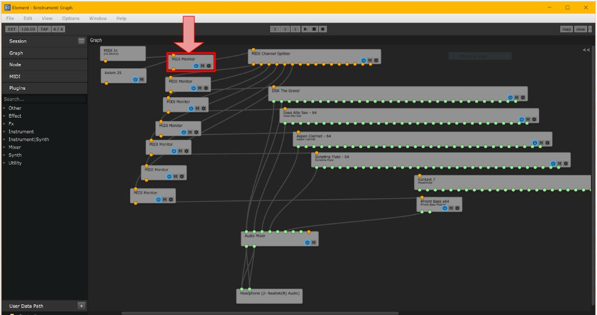

# Novel_MIDI_Instruments

## Overview
ECD 423 Novel MIDI Instruments is a Senior Capstone Project from 2023-2024. The purpose of this project was to design a creative Novel MIDI Instrument capable of polyphony, pitch bend and variable volume control. The product would utilize the functions of a synthesizer. This project is using the open-source synthesizer, Element. The general design consists of a detachable L-shaped rail which can fit on any ordinary tripod boom mic stand. The product consists of 2 keypads and a base station. The base station contains a tilt detection system and is fixed to the center of the rod. Depending on the location of the keypad on the rail, both keypads’ orientation as well as angle of rod tilt, the MIDI device is able to switch between different instruments. The 2 keypads are able to freely slide up and down the rod and act as the inputs for the user to control the available instruments on the mic stand. The entire system consists of 3 microcontrollers and 3 nRF24L01 transceiver modules. The transceiver modules create a long signal transmission line which works to send MIDI signals from the moment the user presses on a key or input device to the moment a note is emitted from the synthesizer.

## Final Design Product

 

An image of the Novel MIDI Instrument with both keypads and base station assembled on the tripod boom mic stand.

## Arduino IDE Setup

### Libraries Installation
1. **Control Surface Library by tttapa**
2. **Joystick by Giuseppe Martini**
3. **RF24 by TMRh20**
4. **light_CD74HC4067 by SunitRaut**
5. **Encoder by Paul Stoffregen**
6. **SPI**

### Code Upload

1. Upload the code from `FinalTest_TxL` to the left keypad.
2. Upload the code from `FinalTest_TxR` to the right keypad.
3. Upload the code from `FinalTest_Rx` to the base station.

### Plugin and Synthesizer Setup

1. Download all plugins from the provided plugin folder.
2. Download the synthesizer program "Kushview Element."
3. Open `NovelMIDISynth.els` from the Synthesizer Plugins & Session Folder in Element.

### Synthesizer Configuration

1. In Element, navigate to `File` > `Preferences` > `MIDI` and select "Control Surface Library" if not already chosen.
2. Exit the preferences screen and double-click on the MIDI Monitor as shown in Figure i below.

 

The image above shows the connections for all plugins within the synthesizer program.
By following these steps, you'll have the necessary components installed, codes uploaded, and synthesizer configured for your project.

## Credits
- Team Members: Sean MacHaffie, Rohan Giridharan, Baron Li

